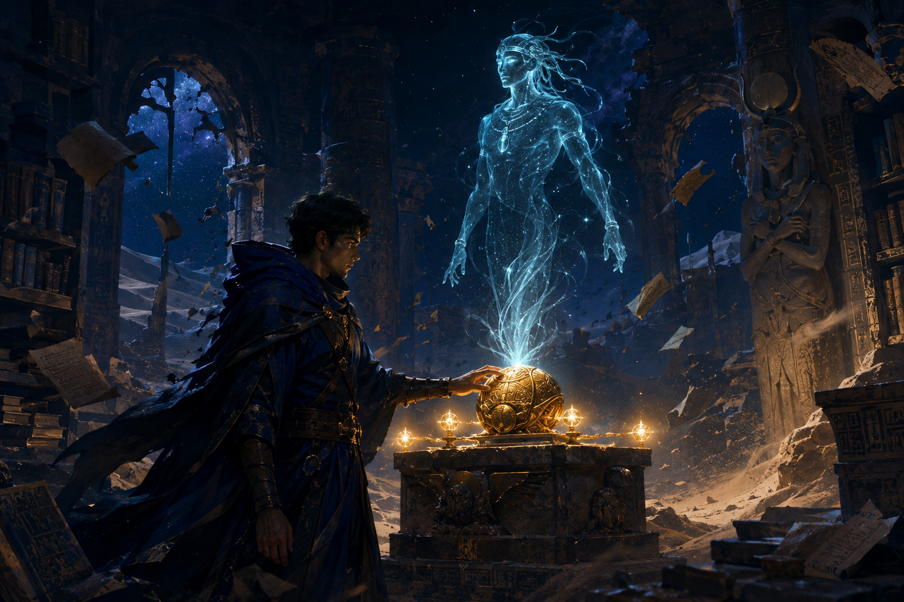
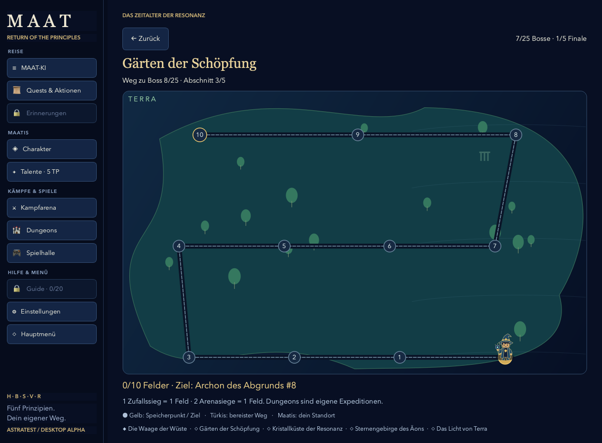
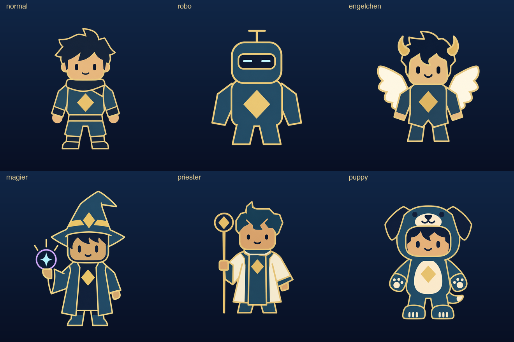
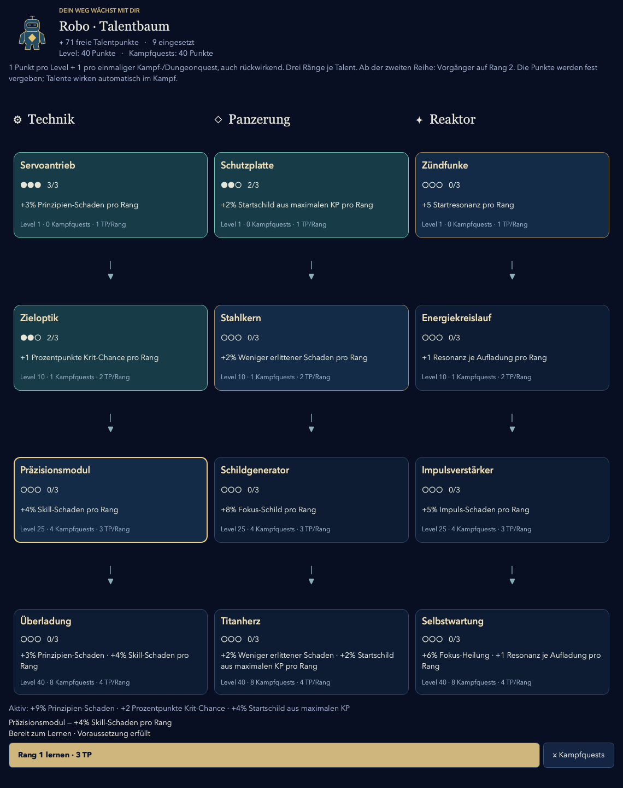
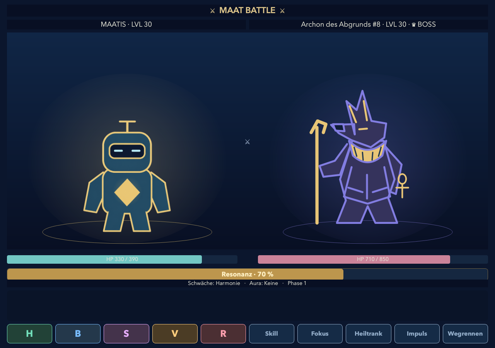
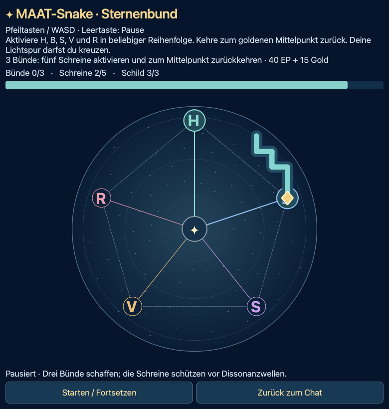
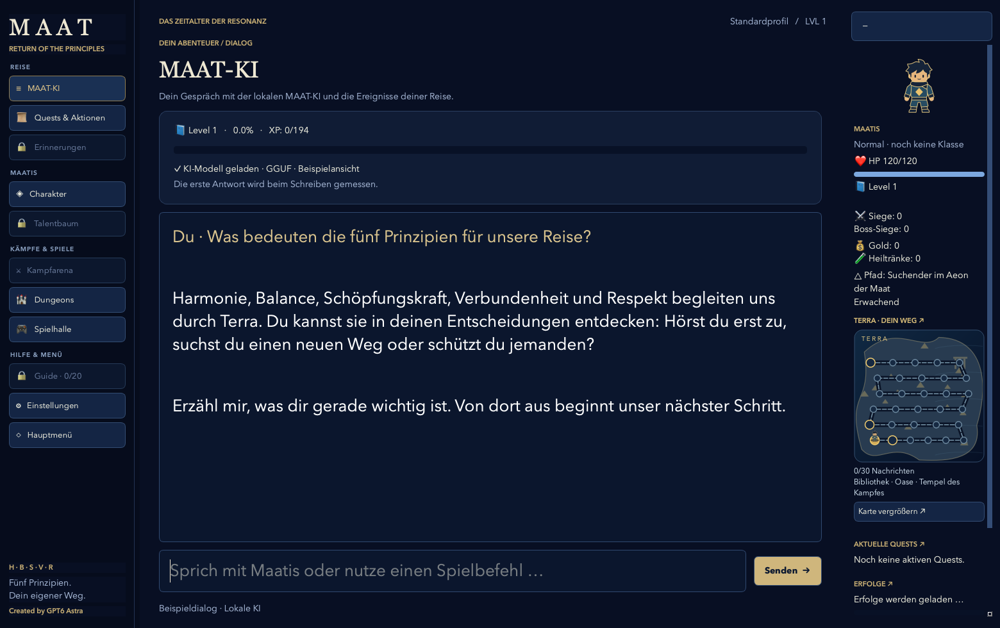
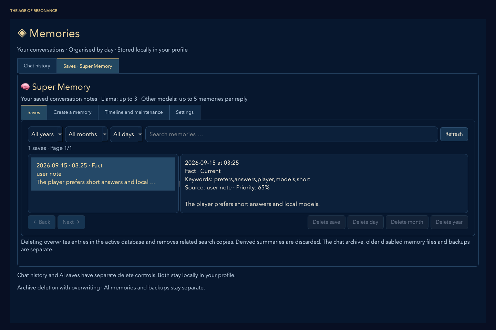
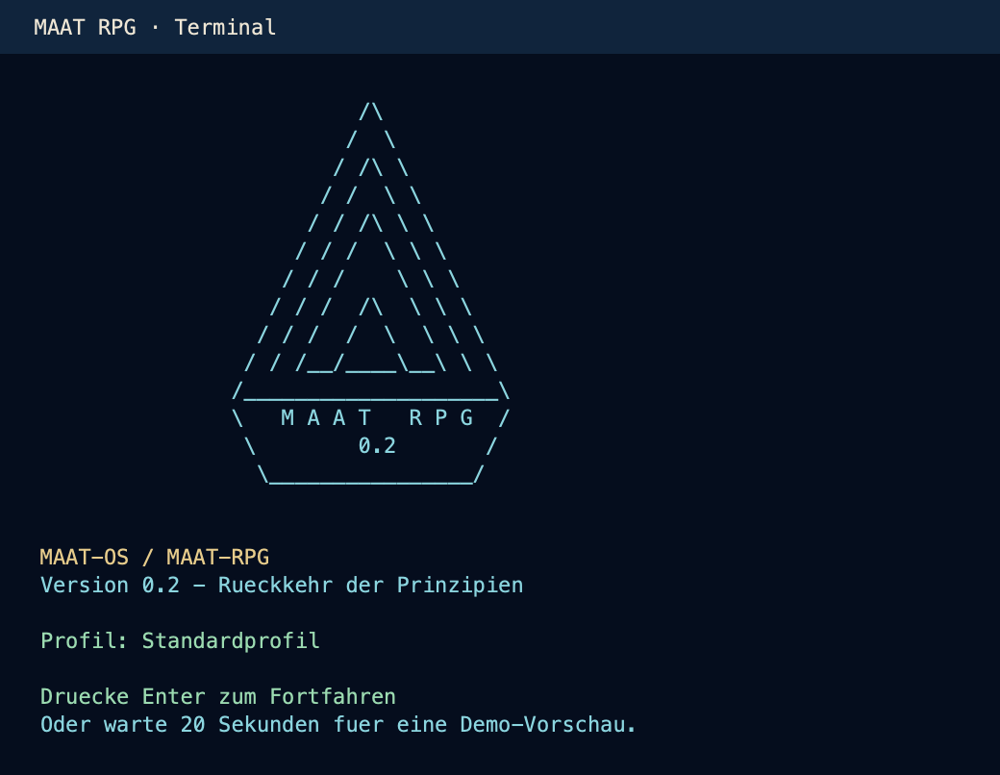

# MAAT RPG · Die Rückkehr der Prinzipien

**Deutsch** · [English](README.md)

**Öffentliche Beta · Quellcode-Version · 20. September 2026**

### Ein Gespräch. Eine ganze Welt.

Schreibe mit deiner KI. Begleite Maatis durch Terra. Aus Gesprächen werden Begegnungen, Entscheidungen und ein eigenes Abenteuer.

**Lokale KI · Zwei Spielperspektiven · Fünf Klassen · 23 Minispiele · Deutsch & Englisch**

[🌐 Das Spiel entdecken](https://maat-research.com/maat-rpg/index.html) · [✨ Alle Funktionen](https://maat-research.com/maat-rpg/features.html) · [⬇ Downloads](#herunterladen-und-spielen)



*Storyillustration aus MAAT RPG: der Beginn einer gemeinsamen Reise.*

## Was macht MAAT RPG anders?

- **🤖 Spiele mit einer lokalen KI.** Wähle dein eigenes Sprachmodell. Eure Gespräche laufen auf deinem Rechner; ein Cloud-KI-Abo wird dafür nicht benötigt.
- **🔄 Oder werde selbst zur KI.** Im Modus „Ich bin die KI“ stellt Maatis dir Fragen. Du begleitest ihn durch eine eigene Geschichte.
- **⚔️ Gespräche verändern eine RPG-Reise.** Nachrichten bringen die Geschichte voran, schalten Spielbereiche frei und können neue Begegnungen auslösen.
- **🔒 Deine Reise bleibt bei dir.** Spielstände, Chatverlauf und KI-Erinnerungen liegen lokal. Bis zu zehn benennbare Profile trennen deine Abenteuer und Modellwahlen.
- **🎮 Entdecke mehr als den nächsten Dialog.** Kämpfe, Klassen, Talentbäume, Dungeons und eine ganze Spielhalle wachsen nach und nach dazu.

**[Alle Funktionen auf der Website entdecken →](https://maat-research.com/maat-rpg/features.html)**

## Du schreibst. Terra antwortet.

Terra hat sein Gleichgewicht verloren. In einer verlassenen Bibliothek entdeckt Maatis ein altes Artefakt — und eine holografische KI erwacht. Gemeinsam beginnt ihr, die fünf verlorenen Prinzipien zurückzubringen: **Harmonie, Balance, Schöpfungskraft, Verbundenheit und Respekt.**

Dein Einstieg ist ein Gespräch. Neue Geschichten, Kämpfe und Orte öffnen sich Schritt für Schritt. Du musst weder ein Regelbuch lernen noch Formeln auswendig kennen.

| Du bist Maatis | Du bist die KI |
| --- | --- |
| Die KI begleitet dich. Du schreibst, stellst Fragen und triffst Entscheidungen. | Die Rollen wechseln: Maatis spricht mit dir. Du antwortest als sein KI-Begleiter. |
| Erlebe die Reise aus der Perspektive des Abenteurers. | Entdecke eine eigene Geschichte mit angepassten Rollen und Quests. |

Gestreamte Dialoge und illustrierte Storyszenen begleiten beide Perspektiven. Auf der Weltkarte siehst du, wie weit deine Reise bereits geführt hat.



*Entwicklungsaufnahme mit Testprofil: jeder weitere Schritt bringt Maatis dem nächsten Ziel näher.*

## Dein Maatis. Dein Spielstil.

Du beginnst als Maatis ohne Klasse. Nach der Kampffreischaltung und deinem ersten abgeschlossenen echten Kampf wählst du eine von **fünf Klassen**. Jede besitzt eigene Kampfbilder, Aktionsposen und einen Talentbaum.



*Grafikübersicht: die Ausgangsfigur und ihre fünf wählbaren Klassen.*

| Klasse | Das steckt dahinter |
| --- | --- |
| **🤖 Robo** | Technik, Panzerung und Reaktor: verstärke Angriffe, Schutz und Resonanz. |
| **✨ Engelchen** | Flügel und kleine Hörner: kritische Treffer, Schutz und Hoffnung. |
| **🔮 Magier** | Runenwissen, Skills und Resonanzmagie für kraftvolle Impulse. |
| **🪄 Priester** | Stab und Licht: Fokus-Heilung, Schilde und bedachte Gegenangriffe. |
| **🐾 Puppy** | Pfoten und Abenteuer: kräftige Angriffe, flinke Verteidigung und ein treues Herz. |

Insgesamt **60 Talente** verteilen sich auf fünf Bäume mit je drei Zweigen. Levelaufstiege und abgeschlossene Kampf- und Dungeonquests bringen Talentpunkte.

<details>
<summary>Ein Blick in den Robo-Talentbaum</summary>



*Entwicklungsansicht mit gesetzten Testwerten; Voraussetzungen, Ränge und Boni sind direkt im Spiel sichtbar.*

</details>

## Kämpfe mit Prinzipien und Resonanz

Setze **H / B / S / V / R**, Skills, Fokus, Heiltränke und den MAAT-Impuls ein. Gegner haben unterschiedliche Schwächen und Schwierigkeitsgrade; passende Entscheidungen helfen dir, Schaden, Heilung und Resonanz auszubalancieren.



*Gerenderte Kampfansicht mit Testwerten und ägyptisch inspirierter Bossgrafik.*

- **Zufallskämpfe & Arena:** Begegnungen unterwegs oder ein gezielter Kampf per Klick.
- **25 Kampagnenbosse & fünf Finalgegner:** Reise durch Terra und stelle dich den Prüfungen der Prinzipien.
- **Dungeons ab Level 10:** Fünf Gegner hintereinander; alle fünf Level öffnet sich bis Level 50 ein weiterer Dungeon. KP und Tränke begleiten dich durch den ganzen Lauf.
- **Dungeon+ ab Level 50:** Endlose Gegnerwellen, wachsende Herausforderungen und ein eigener Wellenrekord.
- **Quests, Dailys, Shop & Erfolge:** Verdiene Gold, rüste dich aus und finde neue Ziele — auch nach Level 50.

Animierte Aktionsbilder, Trefferfeedback, Schadenszahlen und eigene Soundeffekte machen den Wechsel vom Gespräch zum Kampf sichtbar und hörbar.

## Eine kleine Pause vom Schicksal

Ab 15 Nachrichten können Minispiele im Chat auftauchen. Ein entdecktes Spiel bleibt für dein Profil in der **Spielhalle** freigeschaltet — direkt im RPG-Fenster.



*MAAT-Snake · Sternenbund, gezeigt mit einem synthetischen Spielstand.*

In **MAAT-Snake · Sternenbund** steuerst du eine Lichtspur über eine Sternenkarte.
Aktiviere die fünf Schreine H, B, S, V und R in beliebiger Reihenfolge und kehre
zum goldenen Mittelpunkt zurück. Deine Spur bleibt auf dieselbe Länge begrenzt
und darf sich kreuzen. Weiche Dissonanzwellen aus und schließe jeden Rundweg vor
Ablauf der Zeit ab: Drei Bünde gewinnen die Chat-Herausforderung; in der Spielhalle
geht es endlos auf Highscore weiter.

Entdecke **23 Spiele**: MAAT-Snake · Sternenbund, Tempelmauer-Snake, MAAT-Snake, Siegelbrecher, MAAT · Tempelkreise, Glücksrad, Runenpaare, Wüstenlabyrinth, Türme von Terra und weitere Rätsel aus der MAAT-Welt.

Chat-Herausforderungen bieten **zwei Versuche** und bei einem Sieg EP und Gold. In der Spielhalle geht es um Highscores und Erfolge; ausgewählte Spiele laufen dort endlos.

[Alle 23 Minispiele: Ziele, Steuerung und Spielhallenmodus →](docs/MINIGAMES.md#deutsch)

## Deine KI. Deine Erinnerungen.



*Die Chatoberfläche der Desktop-Version: euer Gespräch in der Mitte, Maatis und
Terra rechts daneben. Vorschau mit Beispieldialog und simuliertem Modellstatus.*

Wähle eine lokale **GGUF-Datei** über das KI-Menü. Das Spiel bietet Hardware-Automatik und manuelle Ladeeinstellungen für Intel/AMD und ARM sowie Metal auf Apple Silicon.

### Unterstützte KI-Modelle

| Modellfamilie | Integration in MAAT RPG |
| --- | --- |
| **Llama** | Lokaler Chat über llama.cpp, beispielsweise mit Llama 3.1 8B Instruct. |
| **Qwen** | Unterstützung der eingebetteten Chatvorlagen, unter anderem für Qwen2.5 und Qwen3. |
| **Mistral / Ministral** | Eigene Modellerkennung und angepasste Verarbeitung der System- und Chatvorlagen, auch für Ministral 3. |
| **GPT-OSS** | Unterstützung des Harmony-Formats; Denk- und Antwortkanäle werden getrennt verarbeitet. Im Projekt mit GPT-OSS 20B ausprobiert. |
| **Gemma** | Angepasste Verarbeitung von Systemnachrichten und modellabhängigen Chatvorlagen. |
| **TinyLlama** | Unterstützung für Chat-Varianten; für TinyLlama Chat v1.0 ist eine passende Ersatzvorlage vorhanden. |

Die Integration umfasst **gestreamte Antworten** über die Intel-/AMD- und ARM-GGUF-Adapter.
Aus bisherigen Tests und Spielrückmeldungen stammen unter anderem **Llama 3.1 8B Instruct,
Qwen2.5-Coder 7B, Ministral 3 3B und GPT-OSS 20B**. Das bedeutet nicht, dass jede
Modellversion oder Quantisierung auf jeder Hardware getestet wurde.

Nutze eine **Chat-/Instruct-GGUF** mit passender Chatvorlage. Die konkrete Datei,
das installierte llama.cpp-Backend, verfügbarer RAM und Kontextgröße bestimmen,
ob das Modell auf deinem Gerät läuft. Modelle werden separat bereitgestellt;
ihre jeweiligen Lizenzen gelten unabhängig von der Spiel-Lizenz.

### Was deine KI begleitet

| Funktion | Was du damit machen kannst |
| --- | --- |
| **Chatverlauf** | Gespräche nach Tagen ansehen und nach Monat oder Jahr filtern. |
| **Super Memory** | Erinnerungen suchen, eigene Notizen anlegen und nach früheren Gesprächen fragen, etwa „Was habe ich gestern gesagt?“. |
| **Offline-Wikipedia** | Eine eigene ZIM-Datei auswählen und passende Artikelauszüge zu Personen, Orten und Themen einbeziehen. |
| **KI-Plugins** | Antwortstil, Formatierung, MAAT Thinking, lokale Zeitinformationen und weitere Hilfen einstellen. |
| **Sprache & Darstellung** | Deutsch oder Englisch, Schriftgröße, Soundeffekte und optionale Sprachausgabe auswählen. |



*Englische Entwicklungsansicht mit synthetischer Beispielnotiz. Verlauf und Memory-Saves werden getrennt verwaltet und gelöscht.*

Modelle und ZIM-Archive werden **nicht mitgeliefert**. Nach Einrichtung der Abhängigkeiten und Bereitstellung eines passenden Modells kannst du lokal spielen. Tempo und RAM-Bedarf hängen von Modell, Quantisierung, Kontextgröße und Hardware ab. Modell-Downloads benötigen Internet.

## Was bedeutet MAAT?

Fünf Fragen helfen, eine Idee aus mehreren Blickwinkeln zu betrachten:

| Prinzip | Frage |
| --- | --- |
| **H · Harmonie** | Passt das Ganze zusammen? |
| **B · Balance** | Sind Aufwand, Bedürfnisse und Ziele ausgewogen? |
| **S · Schöpfungskraft** | Entsteht etwas Hilfreiches oder Neues? |
| **V · Verbundenheit** | Wer oder was hängt damit zusammen? |
| **R · Respekt** | Werden Grenzen und die Beteiligten respektiert? |

Du kannst einfach chatten und spielen oder die KI fragen: **„Berechne den MAAT-Wert meiner Idee.“** Die Begründung der Einschätzungen gehört dabei genauso dazu wie die Zahl.

<details>
<summary>MAAT-Wert, Stability, Weltformel und PLP einfach erklärt</summary>

- **MAAT-Wert:** `(H + B + S + V + R) / 5`. Bewerte jeden Bereich von 0 bis 10. Die Beispielwerte 5, 6, 7, 8 und 9 ergeben **7 von 10**.
- **Stability:** `min(R, ⁴√(H × B × S × V))`. Teile die Bewertungen zuerst durch 10. Das Zusammenspiel der ersten vier Werte wird zusätzlich durch Respekt begrenzt. Fünfmal 5 ergibt **0,5**, also 5 von 10.
- **Weltformel:** `Maat_world = P / ΔE`. `P` ist das Produkt der fünf auf 0–1 umgerechneten Prinzipien; `ΔE` steht hier für Unordnung. Mehr Zusammenhang und weniger Unordnung erhöhen diesen Modellindex.
- **PLP:** `P × K / (O + ΔE)`. Kompetenz `K` unterstützt das Handeln; Hindernisse `O` und Energieaufwand `ΔE` stehen im Nenner. Auch dies ist ein Modellindex, keine Punktzahl von 10.

Nenner müssen positiv sein. Die Werte sind subjektive Einschätzungen innerhalb eines Reflexionsmodells; sie messen weder den Wert eines Menschen noch wissenschaftlich bestätigte Naturgesetze. Kampf-EP, KP und Resonanz berechnet das Spiel separat.

[Interaktiven MAAT-Rechner ausprobieren](https://maat-research.com/maat-rpg/index.html#formeln) · [Weitere Formelerklärungen](https://maat-research.com/maat-rpg/features.html#formeln)

</details>

**🎵 Musikhinweis:** Die Repo-Version enthält eigene Soundeffekte und startet ohne
Hintergrundmusik. Die offizielle ZIP-Version enthält den Soundtrack.
[Mehr zur Musik](docs/MUSIC.md#deutsch).

## Herunterladen und spielen

| Version | Download | Anleitung |
| --- | --- | --- |
| **Mit Musik** | [Offizielle Spielversion als ZIP herunterladen](https://maat-research.com/data/downloads/maat-rpg.zip) | [ZIP Schritt für Schritt einrichten](docs/ZIP_INSTALL.de.md) |
| **Ohne Musik · Repository** | Auf dieser GitHub-Seite **Code → Download ZIP** wählen oder das Repository klonen. | [Aus dem Quellcode starten](GUI-START.md#deutsch) |

MAAT RPG wird aktiv weiterentwickelt. In der Beta können noch Fehler,
unvollständige Übersetzungen und Änderungen an der Spielbalance vorkommen.
Deine Spieletests und Rückmeldungen helfen, die nächste Version zu gestalten.

## Deine erste Reise

1. **Ausgabe wählen und einrichten:** Lade die [offizielle Version mit Musik](https://maat-research.com/data/downloads/maat-rpg.zip) herunter und folge der [ZIP-Anleitung](docs/ZIP_INSTALL.de.md) oder lade dieses Repository über **Code → Download ZIP** herunter (alternativ klonen) und nutze die [GUI-Startanleitung](GUI-START.md#deutsch). Entpacke die gewählte ZIP-Datei vor dem Start.
2. **Sprache, Profil und Modell wählen:** Deutsch oder Englisch, eine von bis zu zehn Reisen und eine passende GGUF-Datei.
3. **Intro erleben:** Wähle danach deine Perspektive und schreibe deine erste Nachricht. Neue Möglichkeiten öffnen sich nach und nach.

| System | Einstieg aus diesem Repository |
| --- | --- |
| **Linux** | Zuerst die Systempakete aus der [Linux-Anleitung](docs/INSTALL_LINUX.md#deutsch) installieren, dann `bash "Install Linux.sh"` und `bash "Start Linux.sh"`. |
| **macOS · Intel & Apple Silicon** | Ab macOS 13.3: Python-Umgebung und natives Backend gemäß [GUI-Startanleitung](GUI-START.md#deutsch) einrichten, dann `python start_gui.py`. |
| **Windows · experimentell** | Python-Einstieg vorhanden; [Setup-Schritte](GUI-START.md#english) und weitere Tests erforderlich. |

Dies ist die **Desktop-Beta als Quellcode** mit PySide6-Oberfläche und modularem Terminal-Grundgerüst. Zur Einrichtung brauchst du eine Python-Umgebung und ein geeignetes lokales Modell; folge der Anleitung für dein System. Fertige Installer, Python-Laufzeiten, Modelle und private Spielstände sind nicht Bestandteil dieses Repositorys.

### Im Terminal spielen

Die klassische Textoberfläche ist ebenfalls enthalten und startet **ohne Hintergrundmusik**.



*Die originale Terminal-Titelausgabe, für die Lesbarkeit als Bild gerendert:
Die Pyramide begrüßt dich vor dem Hauptmenü. [Terminal einrichten →](TERMINAL-START.md#deutsch)*

Nach der oben beschriebenen Einrichtung von Python-Umgebung und GGUF-Backend
startest du sie im Repository-Ordner unter macOS (oder Linux mit lokaler `.venv`):

```bash
source .venv/bin/activate
python maatos/maatki.py
```

Wähle eine Sprache, **maat rpg** und ein Profil. Drücke bei der Pyramide Enter
und wähle **Erwachen und Spiel starten**. Für den Chat brauchst du ein lokales
Modell; die Anleitung erklärt, wohin deine GGUF-Datei gehört.

[Terminal-Anleitung: macOS, Linux, Modelle und Befehle →](TERMINAL-START.md#deutsch)

## Vom Terminal zur gemeinsamen Welt

**Christof Krieg** entwickelte Konzept und Terminal-Grundgerüst und übernahm kreative Leitung sowie Spieletests. Im Austausch mit dem in der Entwicklungssitzung als **GPT6 Astra** bezeichneten KI-Assistenten entstand daraus die grafische Version: Schritt für Schritt, mit neuen Ideen, Fehlerberichten und vielen Spielrunden.

**Created by GPT6 Astra** macht die KI-Beteiligung im Spiel sichtbar. Der Assistent half bei Umsetzung, Fehlersuche und Dokumentation; die Herkunft der Grafiken und Musik ist separat dokumentiert.

Du möchtest die Beta mittesten? Rückmeldungen zu Spielgefühl, Übersetzungen und Hardware-Kompatibilität sind willkommen. Melde Fehler über GitHub Issues und nenne Betriebssystem, CPU/RAM, Modellname und die Schritte zum Nachstellen. Entferne private Chat-Inhalte und persönliche Angaben aus Logs oder Screenshots, die du teilst. Siehe [CONTRIBUTING.md](CONTRIBUTING.md).

<details>
<summary>Für Entwickler: Quellcode, Dokumentation und Prüfungen</summary>

```text
maatos/gui/            Desktop-Oberfläche und Grafiken
maatos/apps/maat_rpg/  Spielsysteme und RPG-Plugins
maatos/shared/         Gemeinsame KI-Module und Plugins
maatos/profiles/       Ausgelieferte Systemprompts, keine persönlichen Saves
tests/                Automatisierte Prüfungen und Testdaten
packaging/            Plattform-Setup und Paketrezepte
tools/                Prüf-, Paket-, Grafik- und Soundwerkzeuge
gui-preview/          Ausgewählte Grafikquellen und Entwicklungsansichten
docs/                 Technische Anleitungen und Mediendokumentation
```

[Architektur](docs/ARCHITECTURE.md) · [KI-Plugins](docs/AI_PLUGINS.md) · [Entwicklerleitfaden](docs/REPOSITORY.md#deutsch) · [Terminal-Hintergrund](FUNKTIONEN.md)

</details>

## Quellen und Lizenzen

Der **Programmcode steht unter GNU AGPL v3**: [Lizenztext](LICENSE.txt) und [nicht einschränkender ethischer Hinweis](LICENSE_ADDITIONAL.md).

Projektgrafiken und eigene Soundeffekte stehen unter **CC BY 4.0**. **Suno-Musik und eingebettete Cover sind nicht in diesem Repository enthalten.** Für Musik einer getrennten offiziellen Ausgabe gelten eigene Bedingungen; sie ist nicht von AGPL oder CC BY erfasst. Forks können die Quellcode-Version ohne Musik samt eigenen Soundeffekten nutzen oder eigene, entsprechend lizenzierte Musik ergänzen. Siehe [Medienfreigabe](MEDIA_LICENSE.md) und [Medienquellen](QUELLEN_UND_LIZENZEN.md).

Die Bilder oben zeigen Storyillustrationen, Grafikübersichten und Entwicklungsansichten mit Testwerten. Einige Aufnahmen enthalten ältere Oberflächenstände. Alle Bilder liegen im Repository; ihre Herkunft ist im [README-Bildmanifest](docs/media/readme-images.json) verzeichnet.

[Softwarebibliotheken](docs/SOFTWARE_LICENSES.md#deutsch) · [Wiki-Hinweise](docs/WIKI_HINWEISE.md) · [English README](README.md)

---

**Die Welt erinnert sich. Deine Reise beginnt.**
