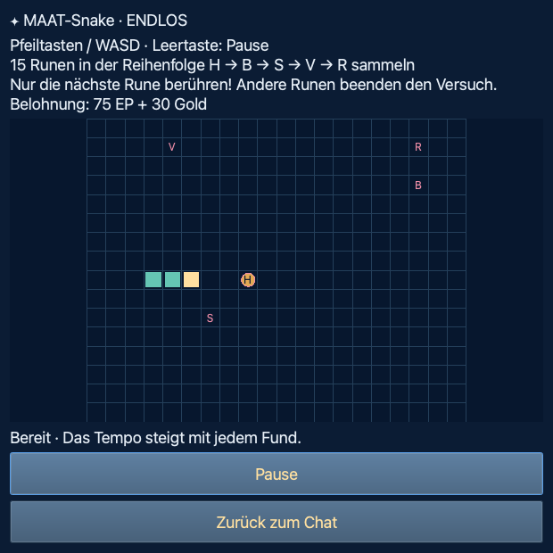

# MAAT RPG · Return of the Principles

**English** · [Deutsch](README.de.md)

**Public Beta · Source Edition · 20 September 2026** — Run the game from source with your
own GGUF model. [Setup and launch](GUI-START.md#english).

## Download and play

Choose the edition that suits you:

| Edition | Download | What's included? |
| --- | --- | --- |
| **🎵 Official version with music** | [Download MAAT RPG with music (.zip)](https://maat-research.com/data/downloads/maat-rpg.zip) | The regular game version with its soundtrack and original sound effects, hosted on the project owner's server. |
| **💻 Repository version without music** | On this GitHub page, select **Code → Download ZIP**, or clone the repository. | Game source code, artwork and original sound effects. Background music and embedded Suno covers are not included; music is off by default. |

**With music:** download and extract the ZIP, then follow the
[step-by-step ZIP guide](docs/ZIP_INSTALL.en.md). It covers macOS Intel/Apple
Silicon, Linux and experimental Windows setup, model selection, music and later starts.

**From the repository:** extract the ZIP or clone the repository, open a terminal
in the folder containing `start_gui.py`, and follow the
[GUI setup guide](GUI-START.md#english). This edition is also the starting point
for modifying the game or making your own fork.

[More about music and sound effects →](docs/MUSIC.md#english)

MAAT RPG is in active development. During the beta, you may encounter bugs,
unfinished translations and changes to game balance. Your playtesting and feedback
help shape the next version.

### A conversation. A whole world.

Talk to your AI. Follow Maatis through Terra. Conversations become encounters, choices and an adventure of your own.

**Local AI · Two perspectives · Five classes · 23 minigames · English & German**

[🌐 Discover the game](https://maat-research.com/maat-rpg/index-en.html) · [✨ Explore all features](https://maat-research.com/maat-rpg/features-en.html) · [▶ Installation](GUI-START.md#english)


*Story artwork from MAAT RPG: the beginning of a shared journey.*

## What makes MAAT RPG different?

- **🤖 Play alongside a local AI.** Choose your own language model. Your conversations run on your computer, without a cloud AI subscription.
- **🔄 Or become the AI yourself.** In “I am the AI” mode, Maatis asks you questions. Guide him through a story of his own.
- **⚔️ Conversations shape an RPG journey.** Messages advance the story, unlock game systems and can trigger new encounters.
- **🔒 Your journey stays with you.** Game saves, chat history and AI memories are stored locally. Up to ten named profiles keep your adventures and model choices separate.
- **🎮 Discover more with every chapter.** Battles, classes, talent trees, dungeons and an entire arcade open up as you progress.

**[Explore all features on the website →](https://maat-research.com/maat-rpg/features-en.html)**

## You write. Terra responds.

Terra has lost its balance. In an abandoned library, Maatis discovers an ancient artifact — and a holographic AI awakens. Together, you begin to restore the five lost principles: **Harmony, Balance, Creative Power, Connection and Respect.**

It starts with a conversation. New stories, battles and places open up one step at a time. You do not need to learn a rulebook or memorize formulas to begin.

| You are Maatis | You are the AI |
| --- | --- |
| The AI is your companion. Write, ask questions and make your own choices. | The roles change: Maatis talks to you. You respond as his AI companion. |
| Experience the journey from the adventurer’s perspective. | Discover a separate story with adapted roles and quests. |

Streamed dialogue and illustrated story scenes accompany both perspectives. The world map shows how far your journey has taken you.


*Development capture with a test profile, shown in German: each step brings Maatis closer to the next destination. The game also supports English.*

## Your Maatis. Your play style.

You begin as Maatis without a class. Once combat is unlocked and you have completed your first real battle, choose one of **five classes**. Each has its own combat artwork, action poses and talent tree.


*Artwork overview: the starting character and five playable classes. The image retains the original German labels.*

| Class | What to expect |
| --- | --- |
| **🤖 Robo** | Technology, armor and reactor talents strengthen attacks, protection and resonance. |
| **✨ Little Angel** | Wings and little horns, with critical hits, protection and hope. |
| **🔮 Mage** | Rune knowledge, skills and resonance magic for powerful impulses. |
| **🪄 Priest** | Staff and light, with focus healing, shields and measured counterattacks. |
| **🐾 Puppy** | Paws and adventure, with strong attacks, nimble defense and a loyal heart. |

There are **60 talents** across five trees, each with three branches. Level-ups and completed combat and dungeon quests earn talent points.

<details>
<summary>Take a look at Robo’s talent tree</summary>


*Development view with test values. Requirements, ranks and bonuses are visible in the game.*

</details>

## Fight with principles and resonance

Use **H / B / S / V / R**, skills, focus, healing potions and the MAAT impulse. Enemies have different weaknesses and difficulty levels; your choices help balance damage, recovery and resonance.


*Rendered combat preview with test values and Egyptian-inspired boss artwork; German interface shown.*

- **Random encounters & arena:** Meet enemies on your journey or start a battle with a click.
- **25 campaign bosses & five final enemies:** Travel across Terra and face the trials of the principles.
- **Dungeons from level 10:** Fight five enemies in succession; a new dungeon unlocks every five levels up to level 50. HP and potions carry through the entire run.
- **Dungeon+ from level 50:** Endless enemy waves, increasing challenges and your own wave record.
- **Quests, dailies, shop & achievements:** Earn gold, prepare for battles and find new goals beyond level 50.

Animated action artwork, hit feedback, damage numbers and original sound effects bring the transition from conversation to combat to life.

## A little break from destiny

After 15 messages, minigames can appear in chat. Each game you discover stays unlocked for that profile in the **arcade**, directly inside the RPG window.



*Development capture of MAAT-Snake, shown in German: collect the next rune and avoid the others.*

Discover **23 games**: MAAT-Snake · Star Covenant, Temple Wall Snake, MAAT-Snake, Seal Breaker, MAAT · Temple Circles, a wheel of fortune, Rune Pairs, Desert Maze, Towers of Terra and more puzzles from the world of MAAT.

Chat challenges give you **two attempts**, with XP and gold for a win. In the arcade, play for high scores and achievements; selected games also offer endless play.

[All 23 minigames: goals, controls and arcade modes →](docs/MINIGAMES.md#english)

## Your AI. Your memories.

Choose a local **GGUF file** in the AI menu. The game offers automatic hardware settings and manual loading controls for Intel/AMD and ARM, including Metal on Apple Silicon.

### Supported AI models

| Model family | MAAT RPG integration |
| --- | --- |
| **Llama** | Local chat through llama.cpp, for example with Llama 3.1 8B Instruct. |
| **Qwen** | Embedded chat-template support, including Qwen2.5 and Qwen3. |
| **Mistral / Ministral** | Dedicated family detection and handling of system/chat templates, including Ministral 3. |
| **GPT-OSS** | Harmony format support, with separate handling of reasoning and answer channels. Tried in the project with GPT-OSS 20B. |
| **Gemma** | Adapted handling of system messages and model-specific chat templates. |
| **TinyLlama** | Support for chat variants, including a fallback template for TinyLlama Chat v1.0. |

The integration includes **streamed replies** through the Intel/AMD and ARM GGUF adapters.
Previous tests and playtesting reports include **Llama 3.1 8B Instruct,
Qwen2.5-Coder 7B, Ministral 3 3B and GPT-OSS 20B**. This does not mean that every
model version or quantization has been tested on every device.

Use a **Chat/Instruct GGUF** with a suitable chat template. Compatibility depends
on the file, installed llama.cpp backend, available RAM and context size.
Models are supplied separately and retain their own licenses, independently
of the game's license.

### Alongside your AI

| Feature | What you can do |
| --- | --- |
| **Chat history** | Browse conversations by day and filter by month or year. |
| **Super Memory** | Find memories, add your own notes and ask about past conversations, such as “What did I say yesterday?”. |
| **Offline Wikipedia** | Select your own ZIM file to include relevant article excerpts about people, places and topics. |
| **AI plugins** | Configure reply style, formatting, MAAT Thinking, local time information and other helpers. |
| **Language & presentation** | Choose English or German, text size, sound effects and optional text-to-speech. |


*English development view with a synthetic example note. Chat history and memory saves have separate management and deletion controls.*

Models and ZIM archives are **not bundled**. Once dependencies and a suitable model are available, you can play locally. Speed and RAM use depend on the model, quantization, context size and hardware. Model downloads require internet access.

## What does MAAT mean?

Five questions help you look at an idea from different perspectives:

| Principle | Question |
| --- | --- |
| **H · Harmony** | Does the whole fit together? |
| **B · Balance** | Are effort, needs and goals in proportion? |
| **S · Creative Power** | Does it create something useful or new? |
| **V · Connection** | Who or what is connected to it? |
| **R · Respect** | Are boundaries and the people involved respected? |

Simply chat and play, or ask the AI: **“Calculate the MAAT score of my idea.”** The reasons behind the ratings matter as much as the number.

<details>
<summary>MAAT score, Stability, world formula and PLP explained simply</summary>

- **MAAT score:** `(H + B + S + V + R) / 5`. Rate each area from 0 to 10. Example ratings of 5, 6, 7, 8 and 9 give **7 out of 10**.
- **Stability:** `min(R, ⁴√(H × B × S × V))`. First divide the ratings by 10. The combined value of the first four principles is capped by Respect. Five ratings of 5 give **0.5**, or 5 out of 10.
- **World formula:** `Maat_world = P / ΔE`. `P` is the product of the five principles on the 0–1 scale; `ΔE` represents disorder here. Stronger connection and less disorder raise this model index.
- **PLP:** `P × K / (O + ΔE)`. Competence `K` supports action; obstacles `O` and energy effort `ΔE` form the denominator. This is also a model index, not a score out of 10.

Denominators must be positive. These are subjective assessments within a reflection framework; they do not measure a person’s worth or scientifically established laws of nature. Combat XP, HP and resonance are calculated separately by the game.

[Try the interactive MAAT calculator](https://maat-research.com/maat-rpg/index-en.html#formeln) · [More formula explanations](https://maat-research.com/maat-rpg/features-en.html#formeln)

</details>

## Your first journey

1. **Choose your edition and set it up:** Get the [official version with music](https://maat-research.com/data/downloads/maat-rpg.zip) and follow the [ZIP setup guide](docs/ZIP_INSTALL.en.md), or download this repository via **Code → Download ZIP** (or clone it) and follow the [GUI setup guide](GUI-START.md#english). Extract your chosen ZIP before starting.
2. **Choose a language, profile and model:** English or German, one of up to ten journeys and a suitable GGUF file.
3. **Experience the intro:** Then choose your perspective and write your first message. New possibilities unlock as you go.

| System | Starting from this repository |
| --- | --- |
| **Linux** | Install the system packages listed in [Linux setup](docs/INSTALL_LINUX.md#english), then run `bash "Install Linux.sh"` and `bash "Start Linux.sh"`. |
| **macOS · Intel & Apple Silicon** | macOS 13.3+: set up Python and a native backend using the [GUI guide](GUI-START.md#english), then run `python start_gui.py`. |
| **Windows · experimental** | A Python entry point is provided; follow the [setup steps](GUI-START.md#english). Further testing is needed. |

This is the **desktop beta, distributed as source code**, with a PySide6 interface and modular terminal foundation. Setup requires a Python environment and a suitable local model; follow the guide for your system. Ready-made installers, Python runtimes, models and private saves are not part of this repository.

## From a terminal to a shared world

**Christof Krieg** supplied the concept, terminal framework, creative direction and playtesting. The graphical version grew through collaboration with the assistant identified in the development session as **GPT6 Astra**: one step at a time, through new ideas, bug reports and many rounds of playtesting.

**Created by GPT6 Astra** makes AI involvement visible in the game. The assistant helped with implementation, troubleshooting and documentation; artwork and music provenance are documented separately.

Want to help test the beta? Feedback on gameplay, translations and hardware compatibility is welcome. Report bugs through GitHub Issues and include your operating system, CPU/RAM, model filename and steps to reproduce the issue. Remove private chat content and personal information from any logs or screenshots you share. See [CONTRIBUTING.md](CONTRIBUTING.md).

<details>
<summary>For developers: source layout, documentation and checks</summary>

```text
maatos/gui/            Desktop interface and artwork
maatos/apps/maat_rpg/  Game systems and RPG plugins
maatos/shared/         Shared AI modules and plugins
maatos/profiles/       Shipped system prompts, not personal save slots
tests/                Automated checks and test fixtures
packaging/            Platform setup and package recipes
tools/                Validation, packaging, artwork and sound tools
gui-preview/          Selected artwork sources and development previews
docs/                 Technical guides and media documentation
```

[Architecture](docs/ARCHITECTURE.md) · [AI plugins](docs/AI_PLUGINS.md#english) · [Developer guide](docs/REPOSITORY.md#english) · [Terminal background](FUNKTIONEN.md)

</details>

## Sources and licenses

The **software is licensed under GNU AGPL v3**: [license text](LICENSE.txt) and [non-restrictive ethical notice](LICENSE_ADDITIONAL.md).

Project artwork and original sound effects use **CC BY 4.0**. **Suno music and its embedded covers are not included in this repository.** Music supplied with a separate official edition retains its own terms and is not covered by AGPL or CC BY. Forks can use the music-free source edition and its original sound effects, or add their own appropriately licensed music. See [Media permissions](MEDIA_LICENSE.md) and [Media sources](QUELLEN_UND_LIZENZEN.md).

The images above show story illustrations, artwork overviews and development views with test values. Some captures show earlier interface revisions. Every image is stored in the repository; see the [README image manifest](docs/media/readme-images.json) for provenance.

[Software libraries](docs/SOFTWARE_LICENSES.md#english) · [Offline Wikipedia notice](docs/WIKI_HINWEISE.md) · [Deutsche README](README.de.md)

---

**The world remembers. Your journey begins.**
