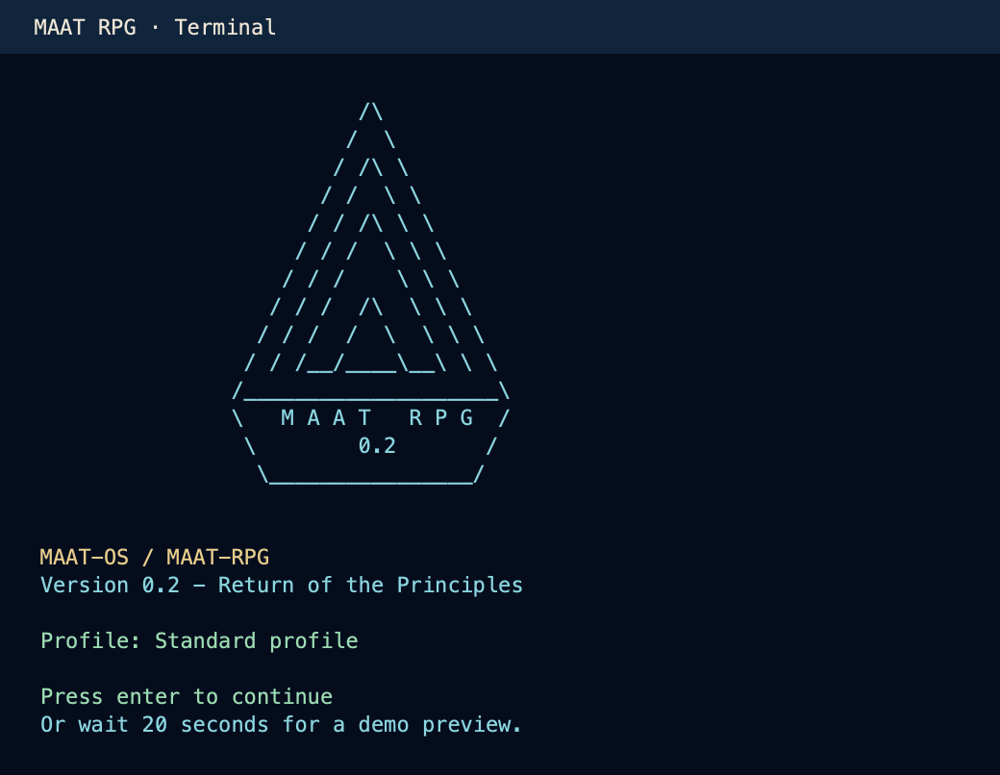

# Play in the terminal / Im Terminal spielen

[English](#english) · [Deutsch](#deutsch)

## English



*Original game output rendered as an image.*

MAAT RPG includes its classic terminal interface: text, numbered menus and slash
commands. This repository edition starts with **background music off**; missing
soundtrack files do not prevent startup. Original sound effects remain available.
The illustrated interface and graphical arcade are part of the desktop version.

### 1. Use the game's Python environment

Open a terminal in the extracted or cloned repository folder containing
`maatos`, `start_gui.py` and this guide. If you have not installed the dependencies
and a native GGUF backend yet, follow [the setup guide](GUI-START.md#english) first.
You can use that same environment for the terminal version.

**macOS, or Linux with a `.venv` in the repository:**

```bash
source .venv/bin/activate
python maatos/maatki.py
```

**Linux after using `Install Linux.sh`:** that installer creates `linux-env` in
the game data folder, not `.venv` in the repository. Use its Python directly:

```bash
"${MAAT_GUI_DATA_ROOT:-${XDG_DATA_HOME:-$HOME/.local/share}/MAAT-RPG}/linux-env/bin/python" maatos/maatki.py
```

If you installed with a custom data location, use the same `MAAT_GUI_DATA_ROOT`
to locate that environment. The classic terminal's profiles and models use the
standard data locations below; its profile selection does not follow the GUI's
custom `MAAT_GUI_DATA_ROOT` setting.

The older `start.sh` / `start.ps1` launchers expect a separate `mos-env` installation.
Use the commands above to reuse the current backend already installed for the GUI.
Native Windows terminal support is not verified; the classic entry point imports
`readline`, which is not included in standard Windows Python.

### 2. Provide a model

Place a suitable **Chat/Instruct `.gguf`** directly in the shared models folder
before starting. On macOS/Linux a symbolic link to your own file also works.

| System | Models folder |
| --- | --- |
| macOS | `~/Library/Application Support/MAAT-RPG/models/` |
| Linux | `${XDG_DATA_HOME:-$HOME/.local/share}/MAAT-RPG/models/` |

The terminal lists local models from this folder. Selecting an external path in
the GUI does not copy that model here. With no local model, the terminal offers a
download; declining exits with a missing-model message. That is unrelated to music.

### 3. Start your journey

1. Select **1 — English** or **2 — German** in the loader.
2. Select **1 — maat rpg** (or press Enter).
3. Choose one of the ten profiles; Enter uses the active profile.
4. At the pyramid, press Enter, then choose **1 — Awaken and start the game**.
5. Follow the model and performance prompts when shown. Enter or Esc skips the intro.
6. Once the model is loaded, confirm the title screen with Enter and start chatting.

Useful commands: `/help`, `/xp`, `/journal`, `/erfolge`, `/fight` once combat is
unlocked, and `/exit` or `/quit` to leave. Before starting the journey, **5 — Quit**
exits from the main menu. **2 — Options and reset** shows the music setting.

The terminal uses the game's standard local profiles. Avoid opening the same
profile in the GUI and terminal at the same time, as both save progress.

[Back to the game overview](README.md)

## Deutsch


*Originalausgabe des Spiels, als Bild gerendert.*

MAAT RPG enthält weiterhin seine klassische Terminaloberfläche: Text, nummerierte
Menüs und Spielbefehle mit `/`. Diese Repo-Version startet mit **Hintergrundmusik aus**;
fehlende Musikdateien verhindern den Start nicht. Eigene Soundeffekte bleiben
verfügbar. Die illustrierte Oberfläche und grafische Spielhalle gehören zur Desktop-Version.

### 1. Die Python-Umgebung des Spiels verwenden

Öffne ein Terminal im entpackten oder geklonten Repository-Ordner mit `maatos`,
`start_gui.py` und dieser Anleitung. Falls Abhängigkeiten und natives GGUF-Backend
noch fehlen, folge zuerst der [Einrichtungsanleitung](GUI-START.md#deutsch).
Für die Terminalversion kannst du dieselbe Umgebung verwenden.

**macOS oder Linux mit einer `.venv` im Repository:**

```bash
source .venv/bin/activate
python maatos/maatki.py
```

**Linux nach Einrichtung mit `Install Linux.sh`:** Der Installer legt `linux-env`
im Datenordner des Spiels an, keine `.venv` im Repository. Nutze dessen Python direkt:

```bash
"${MAAT_GUI_DATA_ROOT:-${XDG_DATA_HOME:-$HOME/.local/share}/MAAT-RPG}/linux-env/bin/python" maatos/maatki.py
```

Bei einer Installation mit abweichendem Datenordner verwende denselben Wert für
`MAAT_GUI_DATA_ROOT`, um die Umgebung zu finden. Profile und Modelle des klassischen
Terminals liegen an den unten genannten Standardorten; seine Profilwahl übernimmt
den benutzerdefinierten GUI-Datenordner aus `MAAT_GUI_DATA_ROOT` nicht.

Die älteren Starter `start.sh` / `start.ps1` erwarten eine separate `mos-env`-Installation.
Mit den Befehlen oben nutzt du das aktuelle, bereits für die GUI eingerichtete Backend.
Der native Windows-Terminalstart ist nicht geprüft; der klassische Einstieg
importiert `readline`, das bei normalem Windows-Python nicht enthalten ist.

### 2. Ein Modell bereitstellen

Lege vor dem Start eine geeignete **Chat-/Instruct-`.gguf`** direkt in den gemeinsamen
Modellordner. Unter macOS/Linux funktioniert auch ein symbolischer Link auf deine Datei.

| System | Modellordner |
| --- | --- |
| macOS | `~/Library/Application Support/MAAT-RPG/models/` |
| Linux | `${XDG_DATA_HOME:-$HOME/.local/share}/MAAT-RPG/models/` |

Das Terminal listet die lokalen Modelle aus diesem Ordner auf. Eine externe
Pfadauswahl in der GUI kopiert das Modell nicht dorthin. Ohne lokales Modell bietet
das Terminal einen Download an; lehnst du ab, beendet es sich mit einem Hinweis
auf das fehlende Modell. Das hat nichts mit der Musik zu tun.

### 3. Die Reise starten

1. Wähle im Loader **1 — English** oder **2 — German**.
2. Wähle **1 — maat rpg** oder drücke Enter.
3. Wähle eines der zehn Profile; Enter verwendet das aktive Profil.
4. Drücke bei der Pyramide Enter, danach **1 — Erwachen und Spiel starten**.
5. Folge gegebenenfalls der Modell- und Performance-Auswahl; Enter oder Esc überspringt das Intro.
6. Bestätige nach dem Laden des Modells den Titelbildschirm mit Enter und beginne den Chat.

Nützliche Befehle: `/help`, `/xp`, `/journal`, `/erfolge`, `/fight` nach der
Kampffreischaltung sowie `/exit` oder `/quit` zum Beenden. Vor Beginn der Reise
verlässt du das Hauptmenü mit **5 — Beenden**. Unter **2 — Optionen und Reset**
siehst du die Musikeinstellung.

Das Terminal verwendet die normalen lokalen Spielprofile. Öffne dasselbe Profil
nicht gleichzeitig in GUI und Terminal, weil beide den Fortschritt speichern.

[Zurück zur Spielübersicht](README.de.md)
