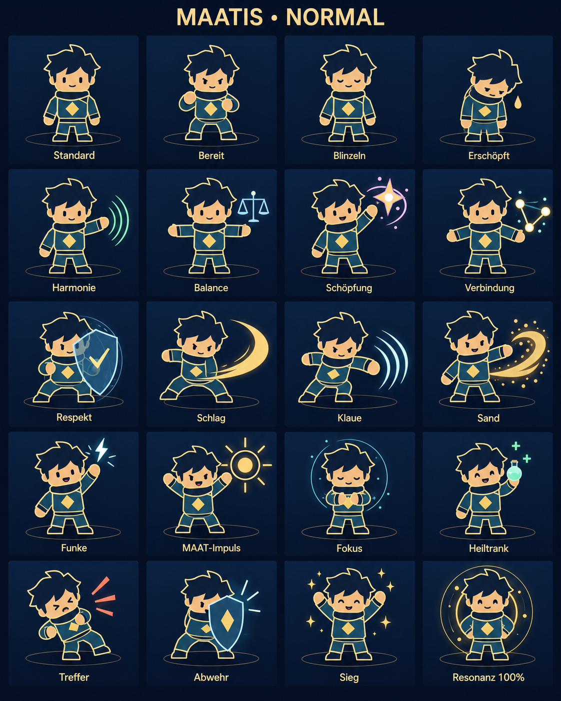
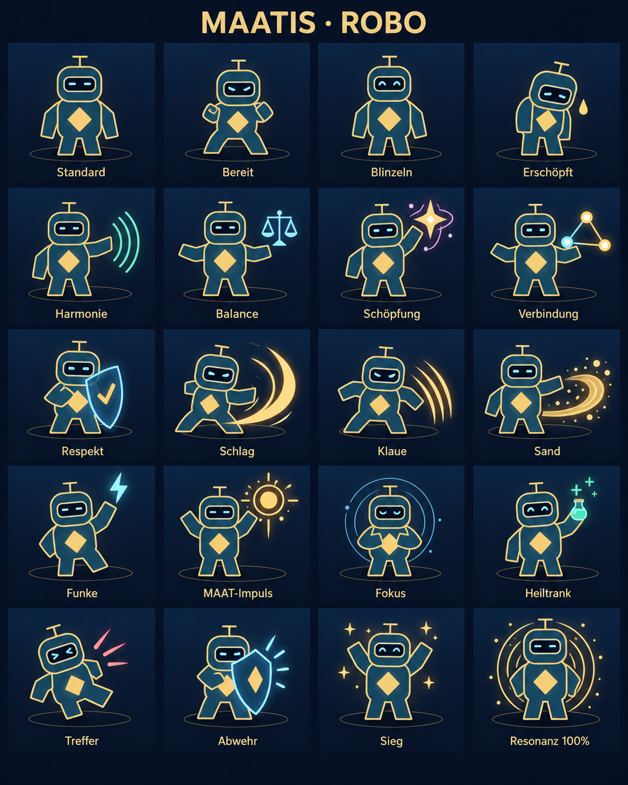
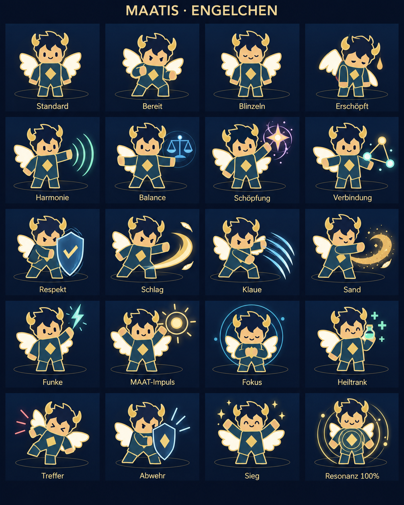
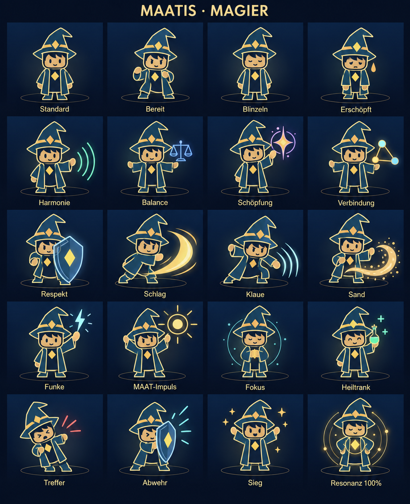
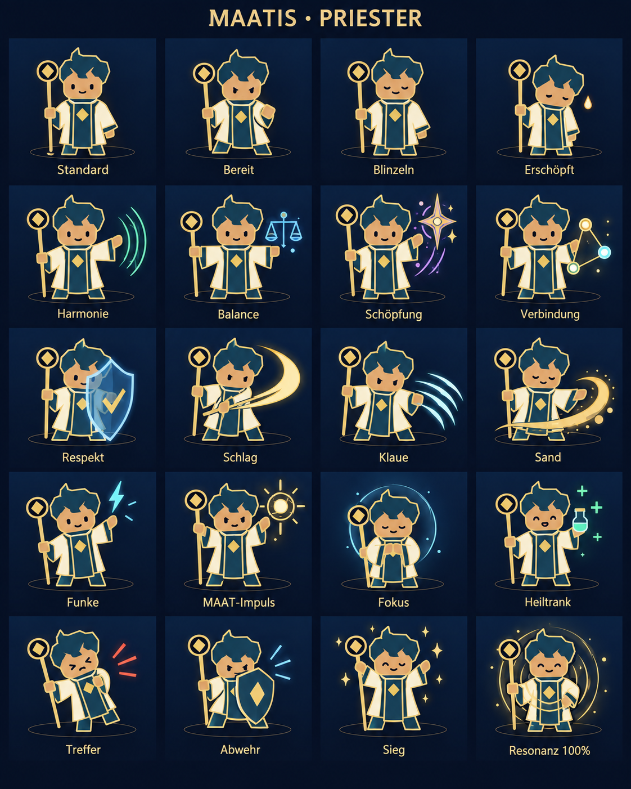
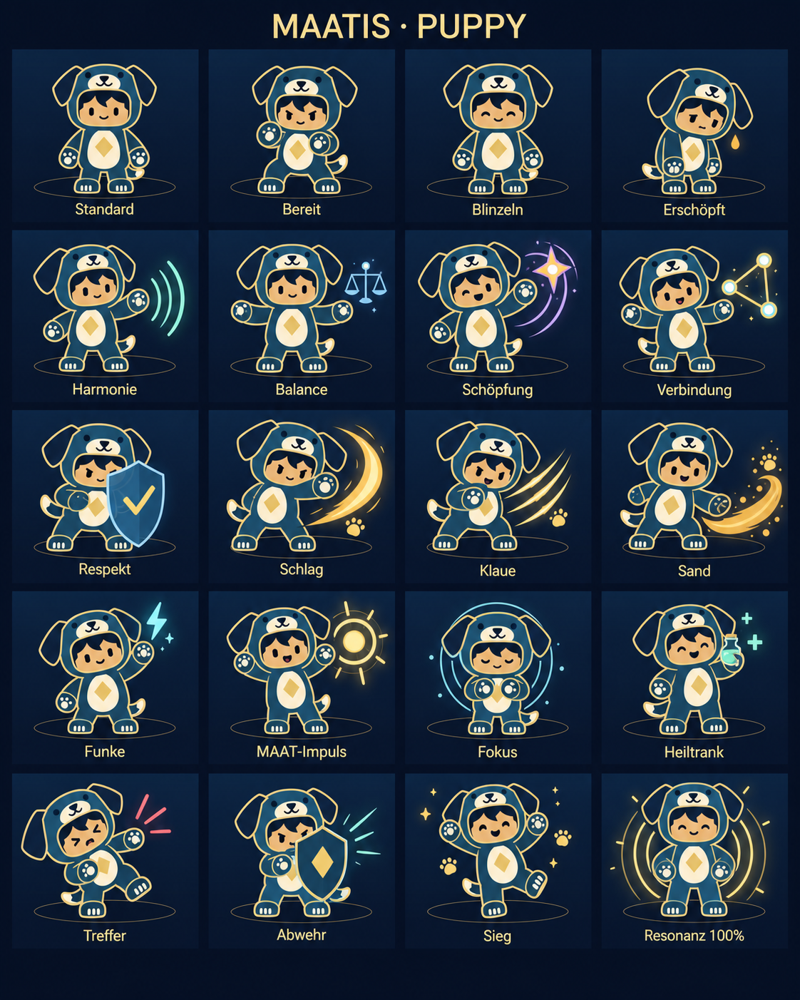

# MAATIS · Kampfgrafiken für alle Klassen

Sechs Posenbögen im bestätigten Stil: einfache blaue Formen, goldene Konturen und ein dunkelblauer Hintergrund. Jeder Bogen zeigt die Figur in 20 Zuständen. Die Klassenausstattung bleibt erhalten; Posen, Gesichtsausdruck und Effekte wechseln passend zur Aktion.

| Maatis · vor der Klassenwahl | Robo |
| --- | --- |
|  |  |

| Engelchen | Magier |
| --- | --- |
|  |  |

| Priester | Puppy |
| --- | --- |
|  |  |

## Umfang der Bögen

Die Reihenfolge ist jeweils von links nach rechts und von oben nach unten vorgesehen.

| Reihe | Spalte 1 | Spalte 2 | Spalte 3 | Spalte 4 |
| --- | --- | --- | --- | --- |
| 1 | Standard | Bereit | Blinzeln | Erschöpft |
| 2 | Harmonie | Balance | Schöpfung | Verbindung |
| 3 | Respekt | Schlag | Klaue | Sand |
| 4 | Funke | MAAT-Impuls | Fokus | Heiltrank |
| 5 | Treffer | Abwehr | Sieg | Resonanz 100% |

Die zehn Angriffsmotive entsprechen den vorhandenen Effekten: `wave`, `balance`, `creation`, `connection`, `respect`, `slash`, `claw`, `sand`, `spark`, `impulse`. Die acht Reaktionen entsprechen `ready`, `blink`, `tired`, `focus`, `heal`, `hurt`, `guard`, `victory`. Dazu kommen die Standardfigur und ein Bild mit voller Resonanz.

Beim Engelchen gehören Flügel und Hörner zum Charakter, beim Magier Hut und Robe, beim Priester sein Stab und beim Puppy das Hundekostüm mit sichtbarem menschlichem Gesicht.

## Dateien und Herstellung

Die sechs PNG-Dateien bleiben vollständige, beschriftete Originalbögen. Ihre Posen sind inzwischen lokal ausgeschnitten und unter `gui/assets/classes/actions-v1` in die Kampfansicht und Demo eingebunden. Das Spiel lädt diese transparenten Einzelbilder. Das Werkzeug `tools/prepare_class_actions.py` erhält die Originale; eine neue Vorschau kann mit [render_class_actions.py](../../tools/render_class_actions.py) erzeugt werden.

Erstellt mit dem integrierten Bildgenerator. Die bestätigten Grundgrafiken in `../class-concepts-v2/` dienen jeweils als Figurenreferenz; `../maatis-presence.png` ist die Vorlage für die Aktionen.

[Prompts und Referenzen](prompts.json) · [Dateiübersicht](manifest.json)
