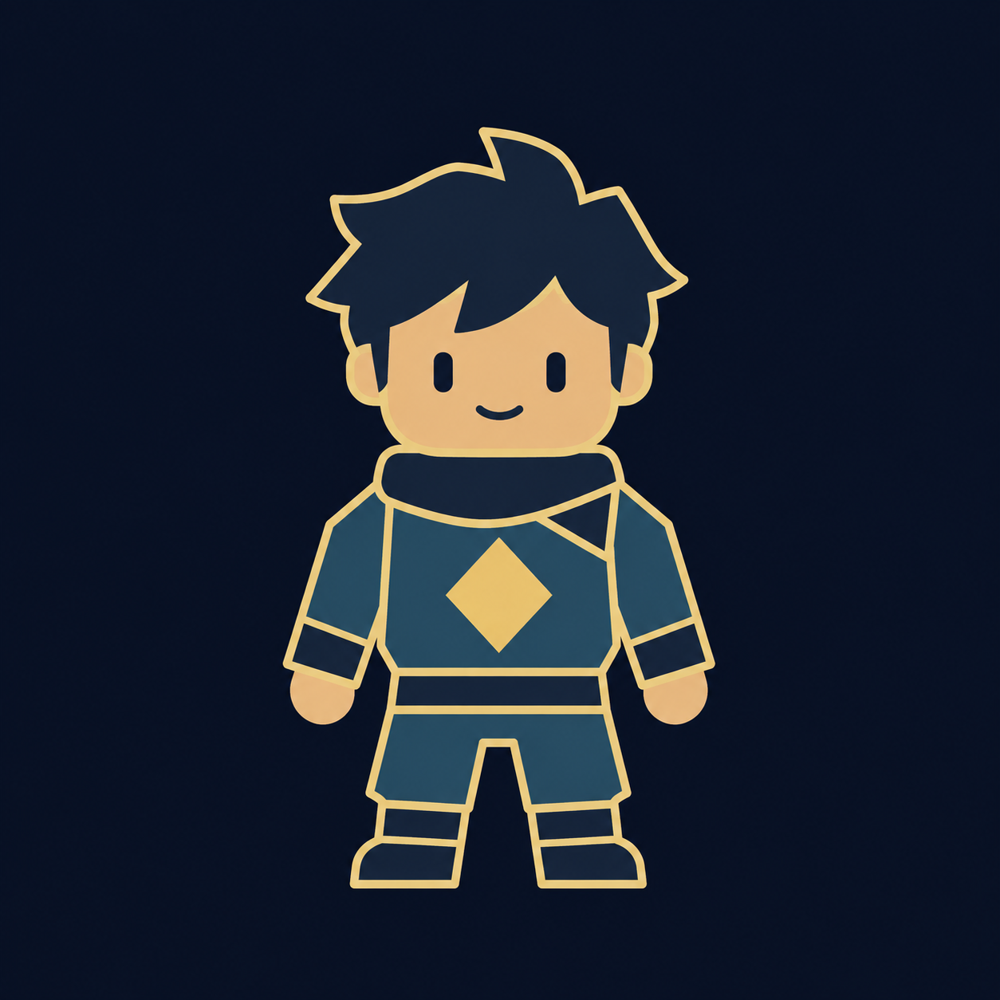

# MAATIS · Klassen im ursprünglichen Stil

Sechs Grundgrafiken mit einfachen Formen, blauen Flächen und goldenen Konturen, angelehnt an die ursprünglichen Kampffiguren. Diese Version dient als Klassenentwurf.

| Maatis · vor der Klassenwahl | Robo · bisheriger Avatar | Engelchen · Flügel und Hörner |
| --- | --- | --- |
|  |  |  |

| Magier · Hut und Magie | Priester · Robe und Stab | Puppy · Hundekostüm |
| --- | --- | --- |
|  |  |  |

Erstellt mit dem integrierten Bildgenerator. Die vollständigen Prompts und Referenzen sind in [prompts.json](prompts.json) dokumentiert. Als Stilvorlagen dienen `characters-standard.png` und `maatis-presence.png` aus `gui-preview`.

Die Dateien sind Konzeptgrafiken; eine Klassenwahl oder Änderung der Kampfgrafiken im laufenden Spiel ist damit noch nicht eingebaut.
